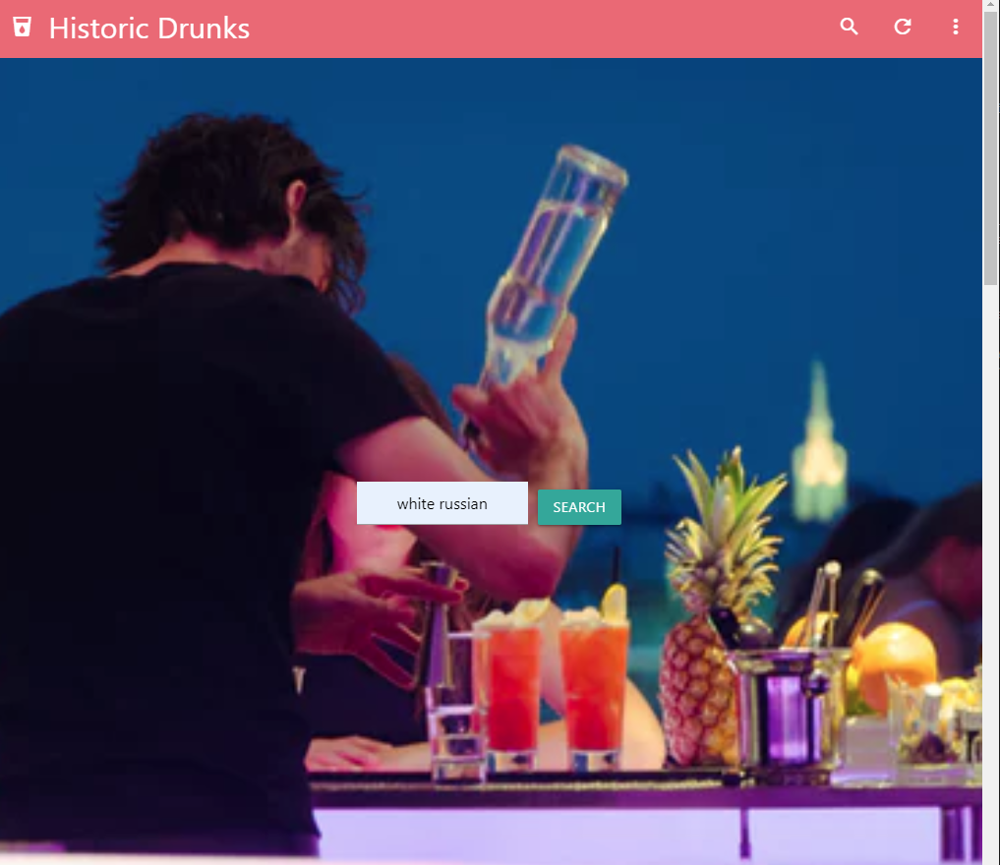
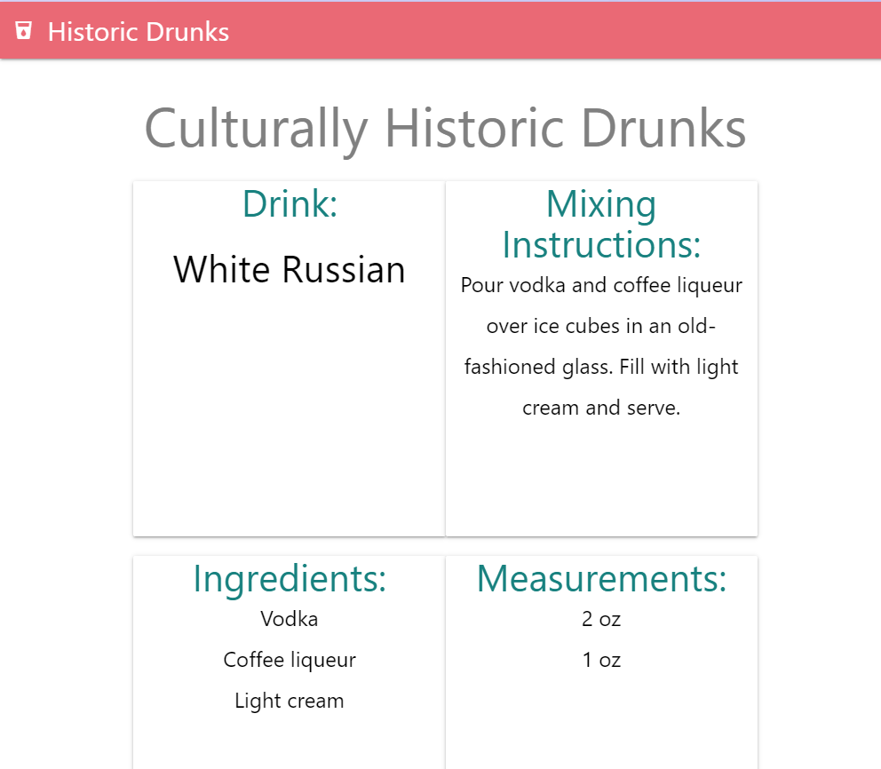
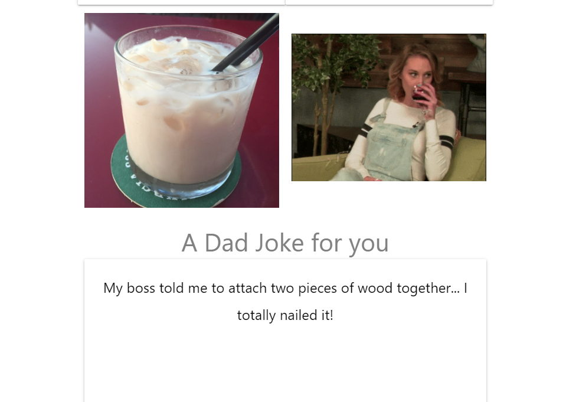

# culturally-historic-drunks

​
![Screenshots of Application] 

​
## Overview
This App is a quick Drink Bartender that gives full instuctions and measurments for mixing, with Humor and fun while making drinks!
​
### [Deployed Live Link >](https://firzlaff.github.io/culturally-historic-drunks/)
​
### Applications Background
We wanted to create an application that would give the correct and exact mixing instructions, ingredients, and measurements. We also wanted to include some fun and humor so the user can have an entertaining drink mixing experience. 

### User Story
I drink with my friends often, I want to navigate to a site/app and have a nice simple look with a search bar for any drink i want to make. When I search this drink I want to be provided with the exact recipe and institutions for making the  as well as the history and culture of that drink ie, where it was invented, when it was invented the person or anyone attributed to this invention information like this.
​
### Features
Our App is deployed and fully functional
​Our App gives you the Image of the completed drink in presentation form. 
Oor App gives you the mixing instructions for perfection
Our App gives you the exact measurements and ingredients for the mixing
Our App adds humor and fun with a Dad Joke and a Random Giphy

### Tech Used
​- HTML - base for project
- CSS with Materialize for Framework
- [JQuery, JavaScript](https://jquery.com/)
- API 1-(CocktailDB.com)
  - This API provided the drink photo, mixing instructions, ingredients, and mixing instuctions for the drink searched. 
- API 2-(icanhazdadjoke.com)
  - This API provided us with a random Dad joke to display
- API 3-(Giphy.com)
  - THis API provided us with a random pg-13 Drinking Giphy to display.    
​
### Contributors​
| Contributor                              |     Contribution     |
|:----------------------------------------:| -------------------- | 
| [Contributor Tysen](https://github.com/) |      API 2 & 3       |
| [Contributor TJ](https://github.com/)  | HTML, CSS, Materialize |
| [Contributor Scott](https://github.com/) |        API 1         |
​
### Roadmap 
We called ourselfs Cullturally Historic as we orginially wanted to include the Culture and History of each drink searhced. to do this we will use the WikiAPI and we plan to implement this. 
We also will be adding additional navigation abilties to go back to the top, or to be able to access the search from extra places within the application. 